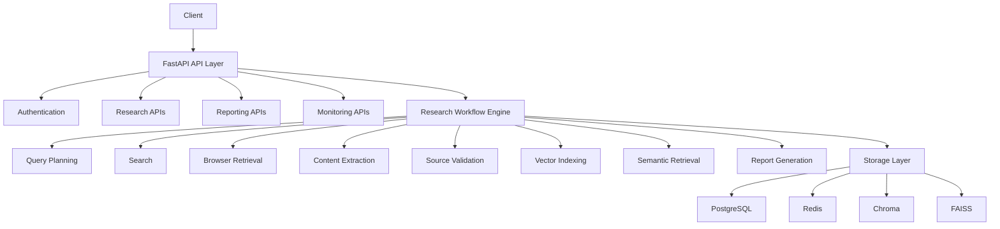

# Autonomous Research Agent

Autonomous Research Agent is a research intelligence platform that automates information discovery, web retrieval, source validation, semantic search, evidence synthesis, and report generation.

The system combines browser automation, vector search, retrieval pipelines, workflow orchestration, and language models to transform complex research questions into structured, evidence-backed reports.

---

## Core Capabilities

### Research Workflow Automation

* Multi-stage research workflows
* Query decomposition
* Evidence gathering
* Source validation
* Semantic retrieval
* Report generation
* Citation tracking

### Web Research

* Browser-based page navigation using Playwright
* HTML content extraction
* Document processing
* Source ranking
* Research evidence collection

### Knowledge Base

* Chroma vector storage
* FAISS vector indexing
* Embedding generation
* Semantic search
* Knowledge retrieval

### Workflow Orchestration

* LangGraph workflow execution
* Multi-step research pipelines
* Research task coordination
* Evidence aggregation

### Authentication and Security

* JWT authentication
* Password hashing with bcrypt
* Role-based access controls
* Rate limiting
* Source validation
* Browser navigation safeguards

### Monitoring and Operations

* Prometheus metrics
* Grafana dashboards
* Research execution metrics
* Queue monitoring
* System health endpoints

---

## Architecture



---

## Technology Stack

### Backend

* FastAPI
* SQLAlchemy Async
* PostgreSQL
* Redis
* Celery

### AI and Research

* LangChain
* LangGraph
* Chroma
* FAISS
* Sentence Transformers

### Retrieval

* Playwright
* BeautifulSoup

### Observability

* Prometheus
* Grafana

### Infrastructure

* Docker
* Docker Compose

---

## Local Deployment (Docker)

### Prerequisites

* Docker
* Docker Compose

### Setup

```bash
cp .env.example .env
docker compose up --build
```

### Available Services

| Service           | URL                       |
| ----------------- | ------------------------- |
| API               | http://localhost:8000     |
| API Documentation | http://localhost:8000/docs |
| Prometheus        | http://localhost:9090     |
| Grafana           | http://localhost:3000     |

### Health Checks

```bash
curl http://localhost:8000/health/live
curl http://localhost:8000/health/ready
curl http://localhost:8000/api/v1/monitoring/health
curl http://localhost:8000/api/v1/monitoring/metrics
```

---

## Production Deployment

### Environment Requirements

* PostgreSQL
* Redis
* Persistent storage
* Reverse proxy
* TLS termination

### Deployment

```bash
docker compose -f docker-compose.prod.yml up -d --build
```

### Recommended Production Configuration

* Dedicated PostgreSQL instance
* Dedicated Redis instance
* Managed backups
* TLS certificates
* Centralized logging
* External monitoring

---

## Database Migration

Run migrations before application startup:

```bash
alembic upgrade head
```

For production deployments:

```env
AUTO_CREATE_TABLES=false
```

---

## Celery Worker

Worker execution:

```bash
celery -A app.tasks.celery_app worker \
  --loglevel=INFO \
  --queues=research
```

---

## API Overview

### Authentication

```http
POST /api/v1/auth/register
POST /api/v1/auth/login
GET  /api/v1/auth/me
```

### Research

```http
POST   /api/v1/research/start
GET    /api/v1/research
GET    /api/v1/research/{id}
DELETE /api/v1/research/{id}
```

### Reports

```http
GET /api/v1/reports/{id}
POST /api/v1/reports/export
```

### Monitoring

```http
GET /api/v1/monitoring/health
GET /api/v1/monitoring/metrics
GET /api/v1/monitoring/executions
```

---

## Testing

Run all tests:

```bash
python -m pytest
```

Static analysis:

```bash
python -m ruff check .
```

---

## Monitoring

### Prometheus

Metrics collection includes:

* API request counts and durations
* API error counts
* Research workflow execution metrics
* Queue monitoring
* Database health metrics
* Redis health metrics

### Grafana

Dashboards provide visibility into:

* Research activity
* Execution performance
* Queue status
* Application health

---

## Security

Implemented protections include:

* Password hashing
* JWT authentication
* Role validation
* Rate limiting
* Source validation
* Browser navigation restrictions
* SSRF protection
* Environment validation

---

## Development Workflow

```bash
docker compose up --build
python -m pytest
python -m ruff check .
```

---

## Project Goal

The platform is designed to automate research workflows by combining web retrieval, semantic search, evidence synthesis, and workflow orchestration into a single research intelligence system.
